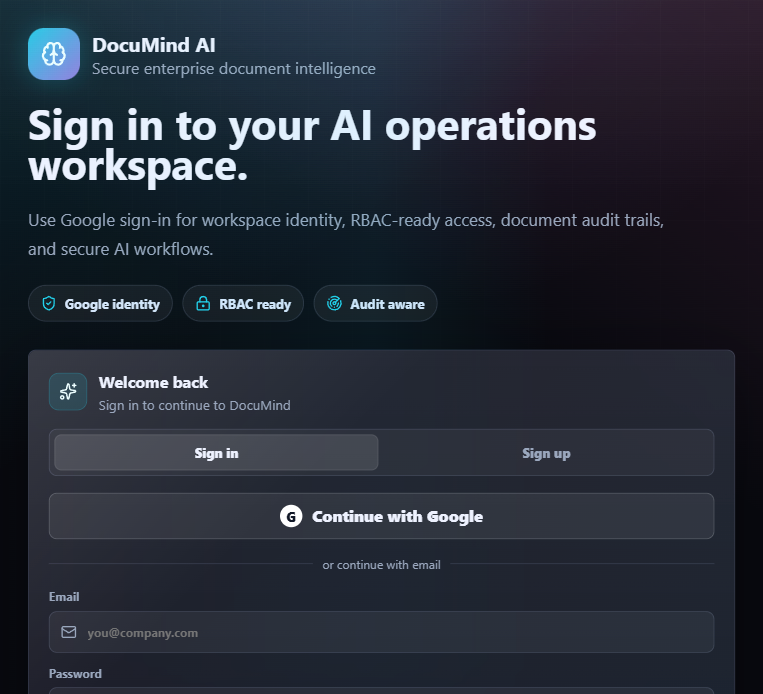

# DocuMind AI

**Enterprise AI Workspace / Document Intelligence Platform**

DocuMind AI is a production-style AI document intelligence platform that converts unstructured documents into searchable, structured, and actionable business intelligence. It includes OCR-assisted ingestion, structured extraction, risk and PII analysis, citation-based RAG Q&A, workflow visualization, authentication, and user-scoped document storage.

Repository: [https://github.com/Aquawolf1290/DocuMind-Ai](https://github.com/Aquawolf1290/DocuMind-Ai)

## Screenshots

### Secure Sign In



## Why This Project

DocuMind AI is built as a portfolio-grade enterprise AI project for CSE/AI students and early-career engineers. It demonstrates practical AI engineering, document automation, secure SaaS architecture, RAG-style retrieval, OCR, compliance checks, user authentication, and a polished enterprise dashboard.

## Core Features

- PDF, DOCX, TXT, and image upload
- OCR-assisted PDF and image extraction with Tesseract
- Native PDF parsing with OCR fallback for scanned or low-text pages
- Metadata extraction, word counts, page counts, and extraction quality indicators
- Semantic chunking with page and paragraph citations
- Document classification for resumes, invoices, contracts, policies, and general documents
- Resume intelligence: candidate name, contact details, location, education, skills, projects, certifications, and job-fit summary
- Structured field extraction with confidence scores and source citations
- PII detection for emails, phone numbers, IDs, bank-like details, and sensitive data
- Risk scoring and compliance flags
- Enterprise RAG assistant with citation-backed answers
- Visual AI workflow / agent orchestration graph
- Per-document query analytics
- Login, sign-up, Google OAuth-ready authentication
- SQLite-backed user accounts, sessions, and user-scoped document storage
- Exportable structured JSON payloads
- PWA-ready frontend and Expo mobile app foundation

## Tech Stack

### Frontend

- React
- Vite
- Framer Motion
- Recharts
- Lucide icons
- Custom enterprise dark UI

### Backend

- FastAPI
- Python
- SQLite
- PyPDF
- PyMuPDF
- python-docx
- pytesseract
- scikit-learn TF-IDF retrieval

### Mobile

- Expo React Native
- Shared FastAPI backend

## Architecture

```text
React / Vite Frontend
        |
        v
FastAPI Backend
        |
        +--> Auth Service
        |      +--> Users
        |      +--> Sessions
        |
        +--> Document Parser
        |      +--> PDF native text
        |      +--> OCR fallback
        |      +--> DOCX/TXT/Image support
        |
        +--> AI Agent Layer
        |      +--> Classifier
        |      +--> Resume/Invoice/Contract/Policy processors
        |      +--> PII detector
        |      +--> Risk analyzer
        |      +--> Summarizer
        |
        +--> RAG Retrieval
        |      +--> Chunks
        |      +--> Citations
        |      +--> Source-grounded answers
        |
        v
SQLite Database + Local/S3-ready File Storage
```

## Run Locally

### 1. Clone The Repository

```bash
git clone https://github.com/Aquawolf1290/DocuMind-Ai.git
cd DocuMind-Ai
```

### 2. Start Everything On Windows

```bash
start-dev.bat
```

Open:

```text
http://127.0.0.1:5173
```

Stop servers:

```bash
stop-dev.bat
```

## Manual Setup

### Backend

```bash
cd backend
python -m venv .venv
.venv\Scripts\activate
pip install -r requirements.txt
python -m uvicorn app.main:app --reload --host 0.0.0.0 --port 8010
```

Backend health check:

```text
http://127.0.0.1:8010/api/health
```

### Frontend

```bash
cd frontend
npm install
npm run dev
```

Frontend:

```text
http://127.0.0.1:5173
```

## Google Sign-In Setup

Email/password sign-up works locally. For real Google sign-in:

Create `frontend/.env`:

```env
VITE_API_BASE=http://127.0.0.1:8010/api
VITE_GOOGLE_CLIENT_ID=your-google-oauth-client-id.apps.googleusercontent.com
```

Create `backend/.env`:

```env
GOOGLE_CLIENT_ID=your-google-oauth-client-id.apps.googleusercontent.com
CORS_ORIGINS=http://127.0.0.1:5173,http://localhost:5173
```

In Google Cloud Console, add authorized JavaScript origins:

```text
http://127.0.0.1:5173
http://localhost:5173
```

Restart frontend and backend after adding env files.

## How To Use

1. Open DocuMind AI in the browser.
2. Create an account using sign-up.
3. Upload a PDF, DOCX, TXT, or image document.
4. Wait for the ingestion pipeline to complete.
5. Open the uploaded document from the workspace sidebar.
6. Review AI Insights, extracted fields, PII alerts, risk score, entities, and topics.
7. Use **Re-read PDF** if a PDF needs OCR-assisted reprocessing.
8. Ask questions in the Enterprise RAG assistant.
9. Check citations in the answer sources.
10. Export structured JSON for downstream business workflows.

## Deployment

Deployment files are included:

- `backend/Dockerfile`
- `render.yaml`
- `frontend/vercel.json`
- `DEPLOYMENT.md`

Recommended deployment:

- Backend: Render Docker web service
- Frontend: Vercel static Vite app
- Storage: Render persistent disk for SQLite and uploads

Read [DEPLOYMENT.md](DEPLOYMENT.md) for the full deployment checklist.

## Resume Line

Built DocuMind AI, an enterprise AI document intelligence platform using React, FastAPI, OCR, SQLite, and RAG-style retrieval to securely upload, classify, extract, risk-scan, and query documents with source-grounded answers.

## Future Improvements

- PostgreSQL database for larger multi-user deployment
- S3-compatible file storage
- Qdrant/Pinecone/Weaviate vector database
- Azure OpenAI/OpenAI LLM integration
- Role-based access control policies
- Team workspaces and audit logs
- Production email verification and password reset
